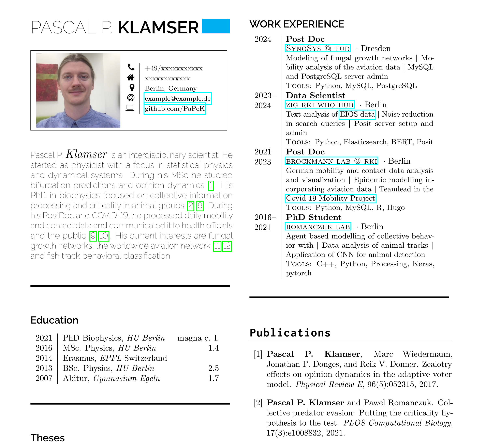

# two-row-academic-cv
A two row academic CV from Pascal P. Klamser forked from https://github.com/latex-ninja/two-row-academic-cv

* added bibtex citations (first use `\bibliography{PsPaper}` than copy the content from `main.bbl` in `main.tex` and comment the line `\bibliography{PsPaper}`)

# Preview 

